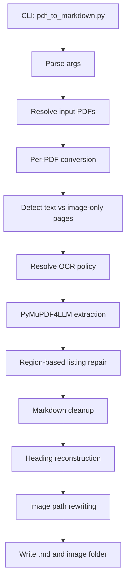
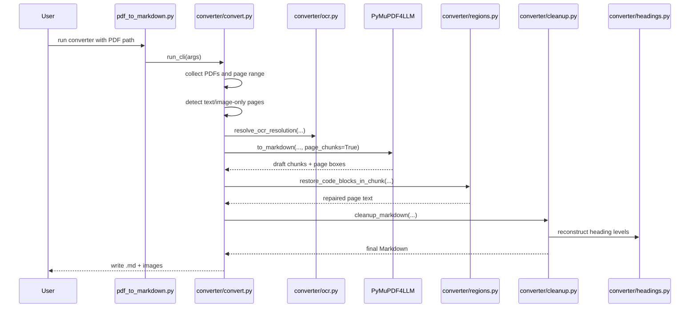
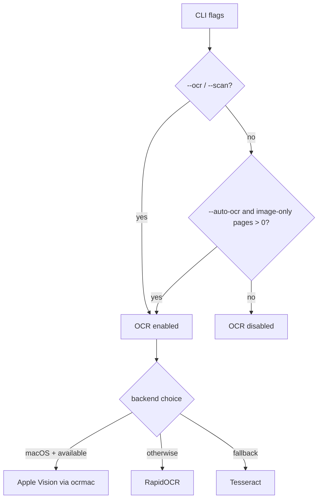
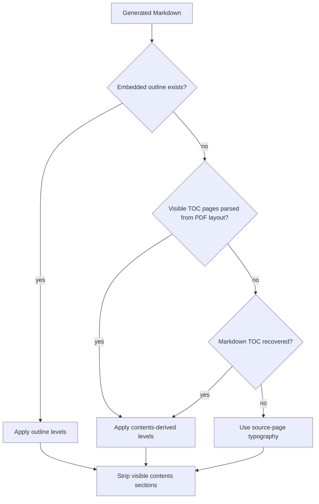
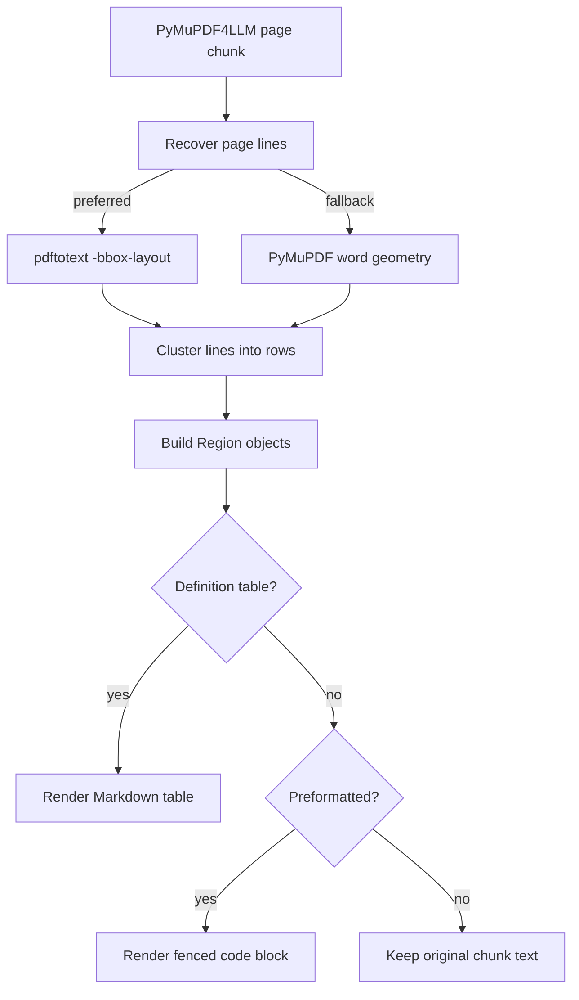

# CONVERSION-DETAILS

This document describes the current implementation as it exists now. It is not a design wish-list and it is not limited to the latest changes. The goal is to explain what the converter actually does, how the pieces fit together, and why some of the design choices look the way they do.

## Purpose

The project converts PDFs to Markdown with a digital-first pipeline:

- born-digital PDFs should be handled primarily through native PDF text/layout extraction
- OCR is available when needed, but it is not the default path for digital PDFs
- technical documents are the main target
  - code and syntax listings
  - command/description layouts
  - headings and contents pages
  - tables
  - extracted images

The current code is split into a thin CLI entry point and an internal `converter/` package:

- `.claude/skills/pdf-to-markdown/pdf_to_markdown.py`
- `.claude/skills/pdf-to-markdown/converter/text.py`
- `.claude/skills/pdf-to-markdown/converter/models.py`
- `.claude/skills/pdf-to-markdown/converter/ocr.py`
- `.claude/skills/pdf-to-markdown/converter/headings.py`
- `.claude/skills/pdf-to-markdown/converter/cleanup.py`
- `.claude/skills/pdf-to-markdown/converter/regions.py`
- `.claude/skills/pdf-to-markdown/converter/convert.py`

## High-Level Flow



## Module Responsibilities

### `pdf_to_markdown.py`

This file is now intentionally small.

Responsibilities:

- define the CLI arguments
- call `converter.convert.run_cli(...)`
- re-export a few helper functions that existing tests still import directly

Relevant code:

- parser definition: [pdf_to_markdown.py:28](/Users/mbackschat/Downloads/pdf-to-markdown-skill/.claude/skills/pdf-to-markdown/pdf_to_markdown.py:28)
- main entry point: [pdf_to_markdown.py:71](/Users/mbackschat/Downloads/pdf-to-markdown-skill/.claude/skills/pdf-to-markdown/pdf_to_markdown.py:71)

Rationale:

- earlier, the whole converter lived in one large file
- the current structure intentionally keeps the entry script thin so the actual logic can evolve in modules without turning the CLI file back into a monolith

### `converter/models.py`

This module contains the shared dataclasses:

- `Region`
- `OutlineEntry`
- `MarkdownHeading`
- `ConversionContext`
- `OcrResolution`

Relevant code:

- [models.py:9](/Users/mbackschat/Downloads/pdf-to-markdown-skill/.claude/skills/pdf-to-markdown/converter/models.py:9)

Rationale:

- these types are used across extraction, layout repair, heading reconstruction, and cleanup
- centralizing them reduces circular duplication and makes module boundaries clearer

### `converter/text.py`

This module contains reusable text helpers:

- output stem sanitization
- whitespace normalization
- Markdown-wrapper stripping
- contents-heading detection
- TOC-entry sanitization
- heading slug/match-key generation
- flattened TOC-entry extraction

Relevant code:

- page-marker constants: [text.py:8](/Users/mbackschat/Downloads/pdf-to-markdown-skill/.claude/skills/pdf-to-markdown/converter/text.py:8)
- heading markup cleanup: [text.py:38](/Users/mbackschat/Downloads/pdf-to-markdown-skill/.claude/skills/pdf-to-markdown/converter/text.py:38)
- inline spacing normalization: [text.py:62](/Users/mbackschat/Downloads/pdf-to-markdown-skill/.claude/skills/pdf-to-markdown/converter/text.py:62)
- TOC helpers: [text.py:82](/Users/mbackschat/Downloads/pdf-to-markdown-skill/.claude/skills/pdf-to-markdown/converter/text.py:82), [text.py:109](/Users/mbackschat/Downloads/pdf-to-markdown-skill/.claude/skills/pdf-to-markdown/converter/text.py:109), [text.py:145](/Users/mbackschat/Downloads/pdf-to-markdown-skill/.claude/skills/pdf-to-markdown/converter/text.py:145)

Rationale:

- these are small, mostly stateless helpers
- they are shared by headings, cleanup, and conversion
- they encode some normalization policy in one place instead of scattering it across the pipeline

### `converter/ocr.py`

This module decides whether OCR is active and which OCR backend is used.

Relevant code:

- backend choice: [ocr.py:44](/Users/mbackschat/Downloads/pdf-to-markdown-skill/.claude/skills/pdf-to-markdown/converter/ocr.py:44)
- OCR resolution policy: [ocr.py:83](/Users/mbackschat/Downloads/pdf-to-markdown-skill/.claude/skills/pdf-to-markdown/converter/ocr.py:83)
- OCR callback wiring: [ocr.py:104](/Users/mbackschat/Downloads/pdf-to-markdown-skill/.claude/skills/pdf-to-markdown/converter/ocr.py:104)
- Apple Vision bridge: [ocr.py:119](/Users/mbackschat/Downloads/pdf-to-markdown-skill/.claude/skills/pdf-to-markdown/converter/ocr.py:119)

Current policy:

- `--ocr` or `--scan` forces OCR
- `--auto-ocr` only enables OCR when selected pages are image-only
- `auto` backend means:
  - `mac` on macOS when available
  - otherwise `rapidocr`
  - otherwise `tesseract`

Rationale:

- the project moved away from OCR-first conversion because most of the target PDFs are digital
- OCR is treated as a targeted fallback path, not as the default converter
- Apple Vision was chosen as the preferred macOS path because it avoids external system installs beyond the Python package bridge

### `converter/regions.py`

This module is the layout-aware recovery layer. It is one of the most important parts of the implementation.

Responsibilities:

- recover positioned lines from source pages
- cluster those lines into rows
- build generic `Region` objects
- classify some regions as:
  - definition-table-like
  - preformatted
- render recovered structure back into Markdown blocks
- merge neighboring regions when they likely belong to the same listing

Relevant code:

- `pdftotext -bbox-layout` path: [regions.py:14](/Users/mbackschat/Downloads/pdf-to-markdown-skill/.claude/skills/pdf-to-markdown/converter/regions.py:14)
- PyMuPDF word fallback: [regions.py:74](/Users/mbackschat/Downloads/pdf-to-markdown-skill/.claude/skills/pdf-to-markdown/converter/regions.py:74)
- row clustering: [regions.py:171](/Users/mbackschat/Downloads/pdf-to-markdown-skill/.claude/skills/pdf-to-markdown/converter/regions.py:171)
- region creation: [regions.py:286](/Users/mbackschat/Downloads/pdf-to-markdown-skill/.claude/skills/pdf-to-markdown/converter/regions.py:286)
- structured-region test: [regions.py:318](/Users/mbackschat/Downloads/pdf-to-markdown-skill/.claude/skills/pdf-to-markdown/converter/regions.py:318)
- definition-table heuristic: [regions.py:341](/Users/mbackschat/Downloads/pdf-to-markdown-skill/.claude/skills/pdf-to-markdown/converter/regions.py:341)
- preformatted heuristic: [regions.py:392](/Users/mbackschat/Downloads/pdf-to-markdown-skill/.claude/skills/pdf-to-markdown/converter/regions.py:392)
- chunk repair orchestration: [regions.py:499](/Users/mbackschat/Downloads/pdf-to-markdown-skill/.claude/skills/pdf-to-markdown/converter/regions.py:499)

Core idea:

- do not try to detect C specifically
- do not try to detect “code language” first
- detect structurally preformatted or aligned regions from geometry

That means the implementation looks at:

- line lengths
- indentation levels
- multiple columns
- punctuation density
- row-to-row alignment
- whether chunk text already matches the recovered row text

Rationale:

- this came directly out of the problems seen in `PureC_English_Overview-JLG.pdf` and `cmanship-v1.0.pdf`
- the key insight was that layout matters more than token vocabulary for listings
- the current implementation still uses heuristics, but they are much more structure-oriented than earlier C-shaped logic

### `converter/headings.py`

This module reconstructs the Markdown heading hierarchy from the strongest available source.

Relevant code:

- page-style line extraction: [headings.py:19](/Users/mbackschat/Downloads/pdf-to-markdown-skill/.claude/skills/pdf-to-markdown/converter/headings.py:19)
- embedded outline extraction: [headings.py:66](/Users/mbackschat/Downloads/pdf-to-markdown-skill/.claude/skills/pdf-to-markdown/converter/headings.py:66)
- visible TOC page parsing: [headings.py:143](/Users/mbackschat/Downloads/pdf-to-markdown-skill/.claude/skills/pdf-to-markdown/converter/headings.py:143)
- Markdown TOC extraction fallback: [headings.py:259](/Users/mbackschat/Downloads/pdf-to-markdown-skill/.claude/skills/pdf-to-markdown/converter/headings.py:259)
- heading extraction from generated Markdown: [headings.py:304](/Users/mbackschat/Downloads/pdf-to-markdown-skill/.claude/skills/pdf-to-markdown/converter/headings.py:304)

Hierarchy sources, in current order:

1. embedded PDF outline / bookmarks
2. visible contents pages parsed from PDF page layout
3. visible contents recovered from extracted Markdown
4. source-page heading typography

The implementation does not rely only on numbering. It uses:

- embedded outline levels when present
- indentation bands on visible contents pages
- normalized heading/title matching
- font-size cues from source pages
- numbering only as one weak supporting signal

Rationale:

- Markdown readers already expose heading navigation, so the goal is not primarily to preserve the PDF TOC verbatim
- the real goal is to reconstruct the heading tree well enough that the Markdown itself becomes navigable
- visible TOCs are mainly internal structure data, not necessarily final output

### `converter/cleanup.py`

This module runs the post-extraction cleanup pass over the Markdown draft.

Relevant code:

- running-header cleanup: [cleanup.py:29](/Users/mbackschat/Downloads/pdf-to-markdown-skill/.claude/skills/pdf-to-markdown/converter/cleanup.py:29)
- image-path rewriting: [cleanup.py:76](/Users/mbackschat/Downloads/pdf-to-markdown-skill/.claude/skills/pdf-to-markdown/converter/cleanup.py:76)
- table cleanup: [cleanup.py:119](/Users/mbackschat/Downloads/pdf-to-markdown-skill/.claude/skills/pdf-to-markdown/converter/cleanup.py:119)
- contents-table to list conversion: [cleanup.py:186](/Users/mbackschat/Downloads/pdf-to-markdown-skill/.claude/skills/pdf-to-markdown/converter/cleanup.py:186)
- main cleanup pipeline: [cleanup.py:412](/Users/mbackschat/Downloads/pdf-to-markdown-skill/.claude/skills/pdf-to-markdown/converter/cleanup.py:412)

Cleanup order, conceptually:

- normalize heading markup
- remove repeated running headers
- normalize visible contents sections enough to use them as structure
- apply heading hierarchy reconstruction
- clean table and bullet noise
- remove visible contents from final output
- merge accidentally split fenced code blocks
- rewrite image references to relative output paths

Rationale:

- this is where the converter trades purity for practical output quality
- the extraction step alone is not enough for the target documents
- the cleanup pass is intentionally stronger than a trivial beautifier, but it tries to stay generic rather than document-specific

### `converter/convert.py`

This module coordinates actual conversion runs.

Relevant code:

- page-range parsing: [convert.py:18](/Users/mbackschat/Downloads/pdf-to-markdown-skill/.claude/skills/pdf-to-markdown/converter/convert.py:18)
- text-page detection: [convert.py:40](/Users/mbackschat/Downloads/pdf-to-markdown-skill/.claude/skills/pdf-to-markdown/converter/convert.py:40)
- extraction via PyMuPDF4LLM: [convert.py:88](/Users/mbackschat/Downloads/pdf-to-markdown-skill/.claude/skills/pdf-to-markdown/converter/convert.py:88)
- per-PDF orchestration: [convert.py:144](/Users/mbackschat/Downloads/pdf-to-markdown-skill/.claude/skills/pdf-to-markdown/converter/convert.py:144)
- CLI batch/file runner: [convert.py:244](/Users/mbackschat/Downloads/pdf-to-markdown-skill/.claude/skills/pdf-to-markdown/converter/convert.py:244)

Responsibilities:

- resolve file vs folder inputs
- compute page selection
- detect text vs image-only pages
- resolve OCR policy
- run extraction
- run cleanup
- write Markdown and images
- handle batch mode reporting

## End-to-End Conversion Flow



## OCR Decision Flow



## Heading Reconstruction Flow



## Listing / Region Recovery Flow



## Data Model

The main shared state object is `ConversionContext`:

- source PDF path
- selected page numbers
- geometry cache
- style cache
- cached outline
- counts of text and image-only pages

This is important because the converter repeatedly revisits the same source document for:

- OCR decisions
- heading reconstruction
- visible TOC parsing
- layout recovery

Without a shared context, the data flow would be even more fragmented.

## Why The Pipeline Looks Like This

### 1. Digital-first extraction

This is a direct response to the project’s main corpus.

Many target PDFs are:

- born-digital
- technical
- layout-sensitive

Using OCR-heavy pipelines for those was hurting structure recovery, especially for listings and headings. So the current status quo treats OCR as optional, not foundational.

### 2. Visible TOC is mostly internal

Markdown readers already give users heading navigation. That means a duplicated visible TOC in the output is often redundant or messy.

So the converter now prefers to:

- learn from the TOC
- reconstruct headings
- strip the TOC from final output

### 3. Listings are reconstructed from geometry, not language vocabulary

This was a major theme of the session that led to the current implementation. Earlier approaches drifted toward overfitting on C or assembler markers. The current structure is explicitly trying to avoid that by relying more on geometry and less on tokens.

### 4. Conservative fallbacks beat clever guesses

In several places the converter chooses a conservative fallback rather than aggressive transformation:

- OCR only when requested or explicitly allowed by `--auto-ocr`
- typography fallback only when stronger structural sources are missing
- `pdftotext` fallback to PyMuPDF geometry rather than inventing layout from prose-normalized text

## Known Structural Limits

The implementation is cleaner than it used to be, but it still has limits:

- many region and layout decisions are threshold-driven
- visible TOC parsing still uses some content-shaped rules
- the cleanup pass is powerful, but still heuristic
- OCR quality still caps scan quality
- some large modules, especially `cleanup.py` and `headings.py`, still combine multiple responsibilities

So the current implementation is not “heuristic-free.” It is better understood as:

- more modular
- more structure-first
- less language-specific
- still heuristic in several important places

## Verification Practices

Current practical verification is:

- unit checks in `tests/test_cleanup_primitives.py`
- sample-based regression checks in `tests/run_regression_checks.py`
- quick smoke test with `PureC_English_Overview-JLG.pdf`

Recommended quick smoke test:

```bash
uv run .claude/skills/pdf-to-markdown/pdf_to_markdown.py tests/pdf/PureC_English_Overview-JLG.pdf
```

Why this file:

- fast enough for iteration
- born-digital
- exercises heading reconstruction
- exercises important listing recovery paths

## Summary

The current converter is a layered system:

- CLI wrapper
- conversion orchestration
- OCR policy
- layout-aware region repair
- heading reconstruction
- Markdown cleanup

Its core design choices are:

- digital-first, OCR-optional
- structure-first rather than language-token-first
- TOC as internal structure data more than final output
- Markdown heading quality as a higher priority than preserving raw contents pages verbatim
