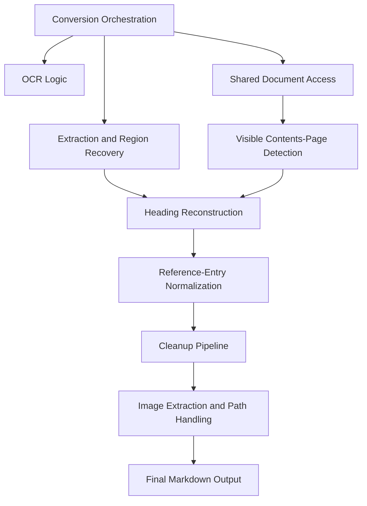
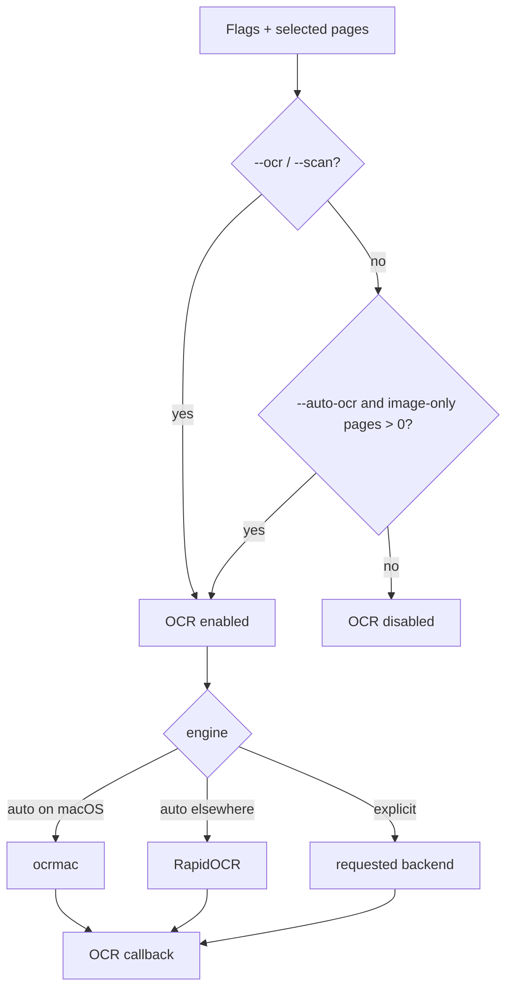
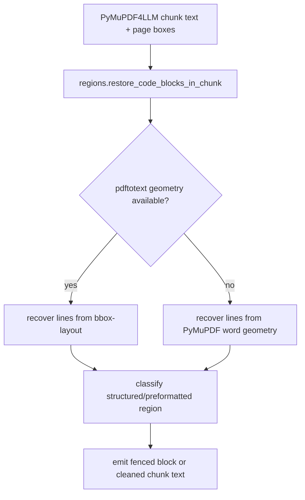
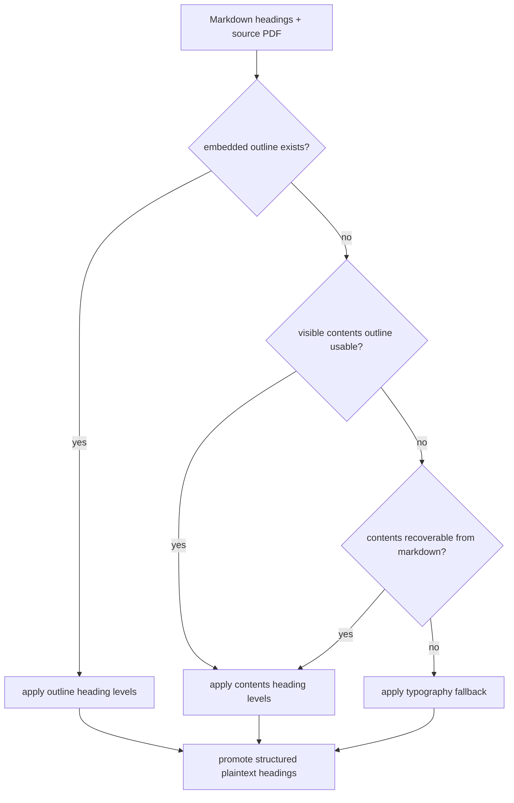

# CONVERSION-DETAILS.md

This document explains the current implementation of the PDF-to-Markdown converter. It is intentionally broader than `README.md` and more narrative than the tests. The goal is to capture the current architecture, the main design choices behind it, and the workflow knowledge needed to understand and maintain the source.

## Scope

This project is a Claude Code skill that converts PDFs to Markdown with a digital-first pipeline built around `PyMuPDF4LLM`, plus a substantial cleanup and structure-recovery layer for technical documentation.

The converter is optimized for:

- born-digital manuals and reference books
- visible TOCs and embedded PDF outlines
- technical listings and preformatted blocks
- extracted figures and diagrams
- scan/OCR workflows when explicitly enabled

It is not a general-purpose “perfect PDF understanding” engine. The current architecture is biased toward technical PDFs where structure recovery matters more than preserving page-faithful visual formatting.

## High-Level Architecture

The code is split into a thin CLI plus a `converter/` package.

- `.claude/skills/pdf-to-markdown/pdf_to_markdown.py`
  - thin entry point
- `converter/convert.py`
  - top-level conversion orchestration
- `converter/document.py`
  - shared PDF/page access and cached source extraction helpers
- `converter/page_types.py`
  - shared page classification, especially visible contents pages
- `converter/ocr.py`
  - OCR policy and backend selection
- `converter/regions.py`
  - layout-sensitive region and listing recovery
- `converter/headings.py`
  - heading reconstruction
- `converter/reference_entries.py`
  - suppression of fake headings in reference/manual layouts
- `converter/contents_cleanup.py`
  - cleanup for extracted visible-contents artifacts
- `converter/cleanup.py`
  - orchestrated markdown post-processing
- `converter/text.py`, `converter/models.py`
  - shared utilities and dataclasses

## End-to-End Flow

## Conversion Orchestration

The practical entry point is `convert.convert_pdf(...)`.

It does the following:

1. Opens the PDF to resolve page count and optional page-range filtering.
2. Detects how many selected pages already contain text and how many are image-only.
3. Builds a `ConversionContext` with:
   - `pdf_path`
   - selected page numbers
   - counts of text and image-only pages
   - shared caches such as:
     - page-style lines
     - layout geometry
     - outline
4. Resolves OCR policy.
5. Resolves output `.md` path and sibling `_images` directory.
6. Runs extraction with `PyMuPDF4LLM`.
7. Repairs listings and structure-sensitive chunks.
8. Runs markdown cleanup and heading reconstruction.
9. Writes the final Markdown and images.

### Why this shape?

The current shape reflects a deliberate preference for:

- shared document access instead of repeated ad-hoc page opens everywhere
- explicit OCR policy instead of implicit behavior
- layout-first recovery for listings
- explicit heading reconstruction stages
- smaller, more responsibility-focused modules

## OCR Logic

The OCR policy lives in `converter/ocr.py`.

Current policy:

- `--ocr` / `--scan`
  - always enable OCR
- `--auto-ocr`
  - enable OCR only if selected pages are image-only
- otherwise
  - do not OCR

Default backend selection:

- macOS
  - prefer Apple Vision via `ocrmac`
- other platforms
  - prefer RapidOCR
- explicit fallback
  - Tesseract if installed and available through PyMuPDF

### Apple Vision integration

The macOS path uses `ocrmac` and writes recognized text back to the page through a PyMuPDF OCR callback.

Important detail:

- inserted OCR text uses `render_mode=3`
- that keeps it searchable but invisible

This is important because visible OCR text would repaint scanned pages and contaminate extracted images with doubled text.

### Current OCR limitation

`--auto-ocr` is intentionally narrow. It only reacts to image-only pages, not to poor text layers. That is a deliberate tradeoff:

- less surprising behavior
- avoids OCR on already-readable digital PDFs
- still leaves room for future improvement if “bad text layer” detection becomes reliable enough

## Shared Document Access

`converter/document.py` centralizes common PDF access patterns.

It currently provides:

- `get_pdf_page_count(...)`
- `detect_text_pages(...)`
- `extract_page_style_lines(...)`
- `extract_page_word_lines(...)`
- `extract_pdf_outline(...)`
- `get_cached_outline(...)`
- `selected_pages_1based(...)`

### Why this module exists

This module centralizes common PDF/page access logic. It does not eliminate every repeated open/close, but it gives the other modules a shared vocabulary for page counts, outlines, style lines, and word geometry.

## Visible Contents-Page Detection

`converter/page_types.py` contains shared logic for classifying visible contents pages.

The current `looks_like_contents_page(...)` rule is intentionally simple:

- the page must contain a contents heading
- after that heading, there must be a minimum number of short, non-sentence-like entries

This classification is reused in multiple places:

- skipping visible contents pages during extracted body assembly
- heading reconstruction from visible TOCs
- suppression/demotion of heading-like text in contents-like contexts

### Design rationale

Visible contents-page classification is shared because the same decision is needed in multiple places. Reusing one predicate is simpler and reduces drift between extraction, heading reconstruction, and heading suppression.

## Extraction and Region Recovery

The main extractor is `PyMuPDF4LLM.to_markdown(...)` with:

- `page_chunks=True`
- image extraction enabled
- OCR callback and OCR policy when applicable
- headers and footers disabled in the extractor itself

The raw chunk output is not trusted blindly. Each chunk is passed through `regions.restore_code_blocks_in_chunk(...)` before it is added to the assembled markdown.

### Why region recovery exists

This converter treats flattened or fragmented preformatted text as a primary quality risk:

- syntax diagrams collapsed to one line
- compiler/project-file examples flattened
- code blocks broken into prose or bullets
- one logical listing split across adjacent chunks or pages

The current implementation tries to reconstruct listings from page geometry rather than from language-specific keyword checks.

### Geometry sources

The recovery order is:

1. `pdftotext -bbox-layout` when available
2. PyMuPDF word geometry as fallback

That fallback order is intentional:

- `pdftotext` is often the strongest source for layout-faithful line structure
- PyMuPDF word geometry keeps the converter functional without a system dependency

### Design rationale

Code and listing preservation is treated as a layout problem first, not a language-detection problem. The current architecture is still heuristic in parts, but the guiding idea is:

- structure first
- content second

## Heading Reconstruction

Heading reconstruction lives mainly in `converter/headings.py`.

The central function is:

- `reconstruct_heading_structure(md_text, context)`

Current priority order:

1. embedded PDF outline
2. visible contents pages parsed from source-page layout
3. contents recovered from extracted markdown
4. source-page typography fallback

After that, the pipeline runs a conservative plaintext heading-promotion step.

### Outline path

If the PDF exposes a bookmark tree, that structure is preferred. The logic:

- loads and sanitizes outline entries
- matches them against extracted markdown headings
- rewrites markdown depth from outline levels

### Visible TOC path

If no embedded outline exists, the converter tries to extract an outline from visible contents pages.

Current visible-TOC parsing uses:

- source-page lines from PyMuPDF text dict output
- indentation clustering
- title/page-number parsing
- title-only TOC fallback when the contents page is visible but lightly flattened

The important design choice here is that indentation is treated as the primary structural signal, with numbering only as a supporting signal.

### Extracted-markdown contents path

If the source-page TOC is not usable, the converter still tries to recover a weaker outline from contents-like text in the extracted markdown itself.

This is less reliable and is intentionally lower priority.

### Typography fallback

If no outline and no usable TOC exists, the converter falls back to source-page typography and heading-like structure.

This path is deliberately conservative because it is the easiest place to overfit or over-promote body text into headings.

### Why multiple heading sources?

Because no single source is enough across the fixture set:

- some PDFs have good embedded outlines
- some only have visible TOCs
- some have neither and need typography fallback

The current layered design is a compromise between robustness and conservatism.

## Running Headers and Page Titles

`cleanup.remove_running_headers(...)` removes repeated heading-like running titles without rewriting heading levels.

Current behavior:

- repeated heading text is counted
- if it repeats enough times and consistently maps to the same top-of-page banner zone, it is treated as a running header
- repeated top banners can be removed even when they are visually large, as long as their source position is consistent enough

This rule is intentionally strong enough to remove repeated large page titles such as `Pure C English Overview` when they recur in the same top-of-page banner zone.

## Reference-Entry Normalization

`converter/reference_entries.py` exists to suppress false headings in reference-like manuals.

This logic was driven heavily by `Atari-Compendium.pdf`, but it is intentionally framed as a generic layout problem rather than an Atari-specific one.

What it looks for:

- repeated entry-title structure
- signature/prototype lines under titles
- left-column field labels with right-column values
- dense short label regions
- caption-like or local heading-like text that should not become part of the document hierarchy

Examples of text that should usually be demoted in a reference-entry layout:

- function signatures
- `OPCODE`
- `PARAMETERS`
- `BINDING`
- `COMMENTS`
- `SEE ALSO`

Important design choice:

- do not globally demote all-caps lines or signatures everywhere
- only demote them in pages/regions that structurally behave like reference entries or dense label lists

This is one of the clearest anti-overfitting decisions in the codebase.

## Cleanup Pipeline

The final markdown cleanup is orchestrated in `converter/cleanup.py`.

Current order:

1. heading-focused pipeline
2. text cleanup pipeline
3. reference-entry normalization
4. strip visible contents sections
5. merge fenced block with code bullets
6. merge adjacent fenced blocks
7. rewrite image references
8. collapse excessive blank lines

### Heading-focused pipeline

`apply_heading_pipeline(...)` currently does:

- `cleanup_heading_markup(...)`
- `remove_running_headers(...)`
- `convert_contents_tables_to_lists(...)`
- `expand_contents_paragraphs(...)`
- `reconstruct_heading_structure(...)`
- `remove_redundant_page_title_headings(...)`

### Text cleanup pipeline

`apply_text_cleanup_pipeline(...)` currently does:

- `clean_markdown_tables(...)`
- `fix_definition_bullets(...)`
- `normalize_prose_lines(...)`
- `split_option_bullet_runs(...)`
- `split_inline_bullet_runs(...)`
- `dedupe_adjacent_bullets(...)`

### Design rationale

The cleanup pipeline separates:

- heading/structure decisions
- text/prose cleanup

This is why `cleanup.py` now has explicit heading and text sub-pipelines rather than one undifferentiated pile of mutations.

## Image Extraction and Path Handling

The extractor writes images into a temporary directory first, then `convert.move_extracted_images(...)` moves them into the final sibling `_images` directory.

This exists for 2 reasons:

1. safer handling of paths with spaces
2. rerun-safe cleanup for existing output folders

The final markdown then has image references rewritten relative to the output `.md` location.

Important detail:

- the image output directory is reset before each run
- extracted images are moved into the final destination after extraction

This avoids rerun failures and makes image handling more predictable, especially for large manuals with many extracted figures.

## What the Tests Cover

The project currently relies on 2 levels of regression coverage.

### Fast unit tests

`tests/test_cleanup_primitives.py` covers:

- OCR-policy behavior
- running-header cleanup primitives
- heading and TOC helpers
- cleanup helpers
- small structural regressions that do not require full PDF conversion

### Fixture regressions

`tests/regression_cases.py` and `tests/run_regression_checks.py` cover durable structural expectations against the sample PDF corpus in `tests/pdf/`.

These tests are intentionally structural rather than whole-file snapshots. The current philosophy is:

- assert the important invariants
- avoid exact-file golden tests unless necessary

That makes it easier to improve the converter without locking the whole output format in place.

## Fixture Knowledge

The regression corpus is small but each file matters for a distinct reason:

- `PureC_English_Overview-JLG.pdf`
  - fastest smoke test
  - catches running page-title leakage and listing flattening
- `cmanship-v1.0.pdf`
  - stresses long listings and image extraction
- `WD1772-JLG.pdf`
  - the main visible-TOC hierarchy test
- `Bitbook2.pdf`
  - the main “be conservative in no-outline fallback” test
- `Atari-Compendium.pdf`
  - the main reference-entry and fake-heading suppression test
- `GEM_RCS-2.pdf`
  - the main OCR and OCR-image interaction test

This corpus is deliberately mixed:

- digital PDFs
- OCR-heavy scans
- manuals with visible TOCs
- manuals without good TOCs
- reference-style pages with repeated internal labels

That diversity is one of the main defenses against overfitting.

## Core Design Decisions

These are the most important architectural decisions reflected in the current implementation.

### 1. Digital-first, OCR-optional

Most PDFs in the target corpus are born-digital. OCR is important, but it should not dominate the default path.

### 2. Stronger source signals before clever heuristics

Prefer:

- embedded outline
- visible TOC layout
- page geometry
- source-page typography

over:

- document-specific text hacks
- language-specific code detection
- title-specific special cases

### 3. Listings are a layout problem first

The converter should preserve listings because of their geometry and preformatted behavior, not because they “look like C”.

### 4. Visible contents pages are structure input, not usually output

Markdown readers already expose headings as navigation. The converter usually benefits more from using visible TOCs internally than from keeping them in the final markdown.

### 5. Conservative fallback is better than aggressive invention

This especially applies to no-outline heading reconstruction. When uncertain, the converter should prefer a flatter, less noisy hierarchy over inventing many false headings.

### 6. Reference-entry suppression must stay structural

The converter should not globally demote all caps, signatures, or field labels. It should only do so when the page/region behaves like a reference-entry layout.

## Known Limitations

The current implementation still has real limits.

- OCR quality remains dependent on the source document.
- Some decisions are still threshold-driven rather than purely structural.
- `pdftotext` remains the strongest geometry source for many listings, so behavior can degrade somewhat when it is unavailable.
- `--auto-ocr` is intentionally narrow and only reacts to image-only pages.
- Some heavily flattened non-code structures still need cleanup after extraction.
- The system is layered and more understandable now, but it is not free of heuristics.

## Practical Summary

The current converter is best understood as:

- a digital-first PDF extractor
- plus a layout-aware listing recovery layer
- plus a layered heading-reconstruction system
- plus a conservative suppression layer for fake headings
- plus targeted markdown cleanup for technical documentation

If you are resuming work later, the best companion files are:

- `CLAUDE.md`
- `tests/regression_cases.py`
- `tests/test_cleanup_primitives.py`
- `tests/run_regression_checks.py`

That combination gives you:

- the current architecture
- the fixture-specific failure modes
- the intended validation workflow
- the executable regression expectations
