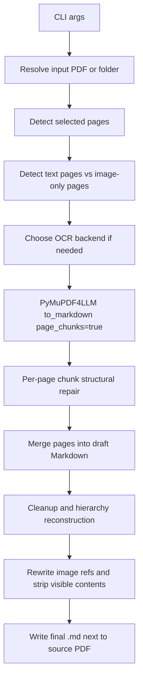
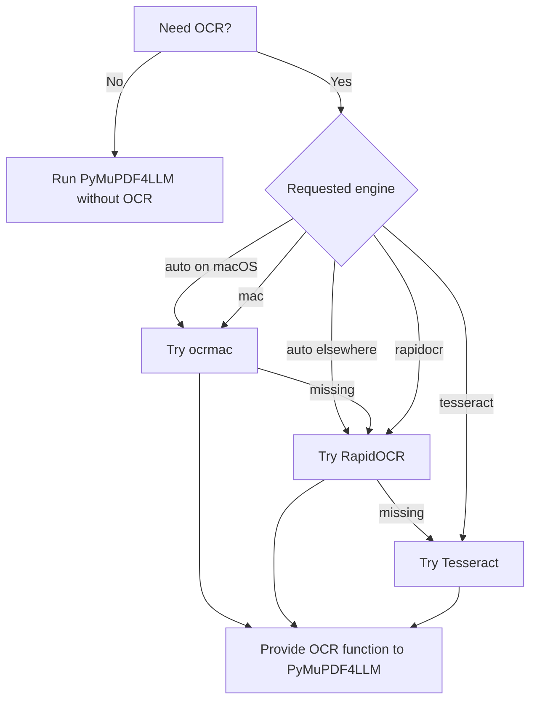
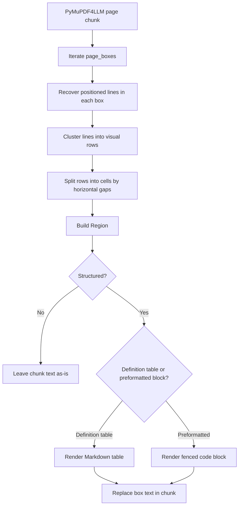
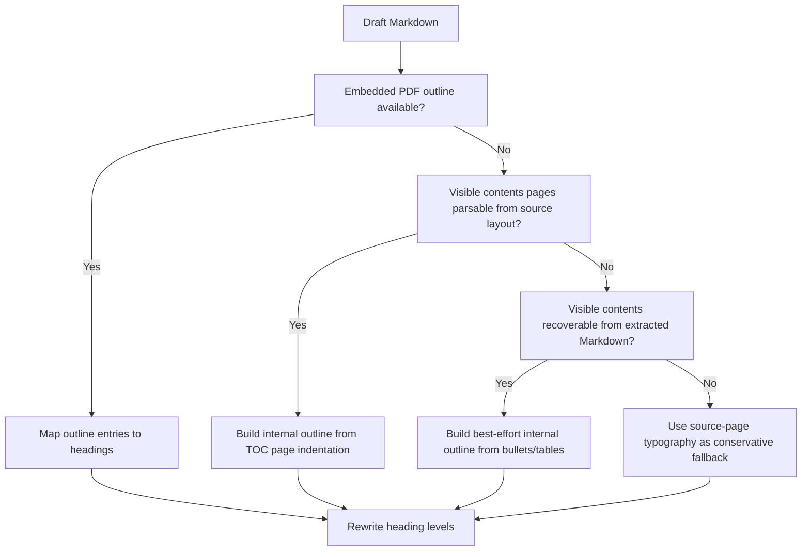
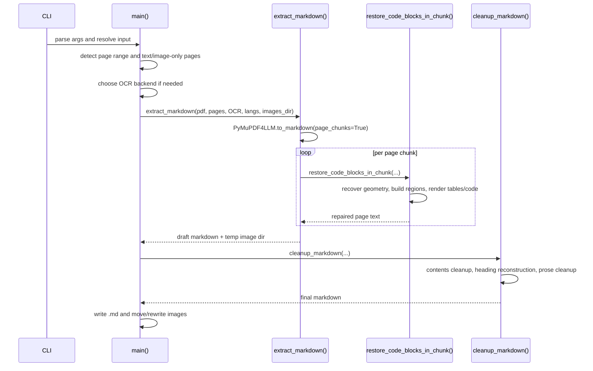

# CONVERSION-DETAILS

This document explains the current status quo of the PDF-to-Markdown converter in this repository. It is not just a change log. The goal is to describe what the code does today, why it is structured that way, and where the main tradeoffs are.

The implementation described here lives primarily in [.claude/skills/pdf-to-markdown/pdf_to_markdown.py](./.claude/skills/pdf-to-markdown/pdf_to_markdown.py).

One important framing note: this document describes the current implementation honestly, not just the desired architecture. The current script is in a transitional state. It already has a cleaner digital-first and structure-first direction, but it still contains older heuristic layers and threshold-driven logic that have not been fully retired yet.

## Goals

The current converter is built around a few practical goals:

- Prefer native structure extraction for born-digital PDFs instead of forcing everything through OCR.
- Keep OCR available for scans and broken text layers.
- Preserve preformatted regions such as code listings, syntax diagrams, file formats, command summaries, and aligned examples.
- Reconstruct Markdown heading nesting from the strongest structural signal available.
- Keep the final Markdown readable in normal Markdown apps without requiring a separate generated table of contents.

This means the pipeline is intentionally digital-first, but it still tries to degrade gracefully when the source PDF is scanned or structurally weak.

## End-to-End Flow

## High-Level Architecture

The script is one file, but conceptually it has 5 layers:

1. Argument handling and file orchestration
2. Extraction and OCR backend selection
3. Layout-aware structural recovery for page chunks
4. Markdown cleanup and heading hierarchy reconstruction
5. Output writing and image-path rewriting

That shape comes directly from the evolution in this session:

- `PyMuPDF4LLM` is the primary extractor because it handles born-digital PDFs better than the earlier Docling-based approach for this repo’s examples.
- OCR is treated as a secondary capability, not the main extraction strategy.
- Preformatted blocks are recovered from layout structure rather than from language-specific code keywords.
- Heading reconstruction is layered so stronger structure sources win over weaker heuristics.

However, the current code is still only partially aligned with that ideal shape:

- newer structural logic and older heuristic cleanup still coexist
- some decisions are still driven by fixed thresholds rather than a fully general region model
- a few content-shaped rules remain in heading and contents handling

The implementation is also no longer fully monolithic. The first cleanup split has already extracted:

- `pdfmd_models.py` for shared converter data structures
- `pdfmd_ocr.py` for OCR policy and backend helpers

The main script still owns most of the conversion flow, but the most self-contained responsibilities have already been pulled out.

## Extraction Layer

### Primary extractor

The script uses `PyMuPDF4LLM.to_markdown(...)` with:

- `page_chunks=True`
- `write_images=True`
- `header=False`
- `footer=False`
- optional OCR integration

Each chunk gives:

- page text
- chunk metadata including the page number
- page boxes describing chunked page regions

The current design treats that output as a strong draft, not as final Markdown.

### OCR policy

The current implementation now uses an explicit OCR contract:

- `--ocr` or `--scan` forces OCR
- `--auto-ocr` enables OCR only when selected pages are image-only
- without either flag, image-only pages are reported but OCR stays off

In code terms, OCR behavior is now resolved centrally instead of being inferred implicitly inside `main()`.

### OCR backend selection

The backend policy is:

- macOS: Apple Vision via `ocrmac`
- other platforms: RapidOCR
- explicit fallback: Tesseract if available

The `auto` path prefers the best installed backend in that order.

## Geometry and Layout Recovery

The most important quality work in the current pipeline happens after extraction, when the script tries to recover structure that was flattened by the extractor.

The key design decision here is:

- do not detect specific programming languages
- detect preformatted structure from layout signals

That was a major point from this session. Earlier iterations drifted toward language-shaped heuristics. The current direction is more generic.

But this needs an honest caveat: the current implementation is not purely structure-only yet. It is better described as:

- primarily structure-driven for listing recovery
- still mixed with some content-shaped heuristics elsewhere in the pipeline

Examples of remaining content-shaped logic include:

- broad heading conventions such as `chapter`, `appendix`, `preface`, `introduction`
- dotted-number recognition in heading and TOC matching
- contents splitting rules that still assume some title-like patterns

### Geometry sources

For structure recovery, the script needs positioned text, not just flat text.

It prefers:

1. `pdftotext -bbox-layout`
2. PyMuPDF word geometry fallback

Why both exist:

- `pdftotext -bbox-layout` often preserves page line structure well for digital PDFs.
- It is optional and may be unavailable or fail on some files.
- PyMuPDF word positions provide a second geometry source without a system dependency beyond the Python package.

### Region model

The script builds a generic `Region` object from recovered lines inside a page box. A region carries:

- page number
- source class
- byte offsets into the chunk text
- bounding box
- snippet text from the chunk
- layout rows derived from positioned lines and words

This is the current internal unit used for structured repair.

### Structural repair pipeline

### What “preformatted” means here

The current classifier is deliberately language-agnostic in the sense that it does not try to recognize specific programming languages like C, Pascal, or assembly. It looks at structural signals like:

- many short rows
- multiple indentation levels
- aligned columns or stable left edges
- low prose density
- punctuation and delimiter density
- agreement between normalized snippet text and recovered rows

This is important because the repo should handle more than C, assembly, or Atari-specific examples.

At the same time, “language-agnostic” here should not be read as “free of all heuristic content assumptions.” The implementation still uses punctuation density, delimiter density, and a few normalization-based comparisons that are generic but still heuristic.

### Definition-table handling

Some PDF layouts are not really code blocks. They are two-column definition layouts such as:

- command on the left
- explanation on the right

The script tries to render those as Markdown tables when:

- rows are mostly two columns
- the two columns align consistently
- the left column is short
- the region does not look code-like

When the evidence is weaker, it prefers readability over aggressive conversion.

That said, the current behavior is still meaningfully threshold-driven. Decisions depend on constants such as:

- row clustering tolerances
- horizontal gap thresholds between words
- inferred indentation step sizes
- overlap and adjacency limits for grouping

Those choices are practical and currently necessary, but they are one of the main remaining sources of brittleness and accidental overfitting.

### Grouping and merging

The script also tries to repair artificial fragmentation:

- adjacent structured text boxes on the same page can be grouped before rendering
- consecutive fenced blocks created only because of page/chunk boundaries can be merged later

This was especially important for longer listings in `cmanship-v1.0.pdf`.

## Heading Reconstruction

Markdown heading nesting is treated as a separate problem from listing repair.

The current principle is:

- use the strongest structural source available
- use weaker heuristics only as fallback
- be conservative when structure is weak

This avoids over-inventing deep heading trees when the PDF does not provide enough signal.

The current implementation is cleaner than the earlier mixed version because legacy heading-depth rewriting no longer runs before the layered hierarchy path. Running-header cleanup is still present, but heading nesting now has one authoritative structural path.

### Hierarchy source order

### 1. Embedded PDF outline

If the PDF exposes a bookmark tree, that is the strongest source.

The script:

- reads `doc.get_toc()`
- sanitizes titles
- filters to selected pages when `--pages` is used
- maps outline entries to extracted Markdown headings in document order
- rewrites Markdown heading levels from that mapping

This works well for documents like `cmanship-v1.0.pdf`.

### 2. Visible contents pages parsed from PDF layout

If there is no embedded outline, the next best source is the visible contents page itself.

The script scans source-page styled lines and:

- looks for a contents heading
- collects likely TOC rows that have dotted leaders and/or page markers
- clusters x-positions into indentation bands
- converts those bands into outline levels

This is the current generic answer for cases like `WD1772-JLG.pdf`.

This step is intentionally conservative. It tries to use layout, not content-specific title patterns.

But the current implementation has an important limitation: it mostly accepts lines that look like classic TOC entries, meaning they have dotted leaders and/or trailing page markers after a recognized contents heading. So this fallback is useful, but not yet as general as “any visible TOC-like page with indentation.”

### 3. Visible contents recovered from extracted Markdown

If source-page TOC layout cannot be recovered, the script makes a weaker attempt from already extracted Markdown:

- convert noisy contents tables to bullet lists
- expand flattened contents paragraphs into bullet lists
- infer best-effort entry levels from indentation and light numbering cues

This is weaker because flattening may already have destroyed part of the original structure.

### 4. Visual heading fallback

If no outline or usable contents structure exists, the script falls back to source-page typography:

- match Markdown headings back to styled source lines
- cluster font sizes into a few visual levels
- combine those levels with broad structural hints

This fallback is intentionally conservative. One of the main lessons from this session was that aggressive fallback nesting creates fake structure in sparse documents.

### Numbering is only a helper

Section numbering is used only as a weak support signal, never as the sole basis for hierarchy.

This matters because many valid headings are plain text:

- `Preface`
- `Features`
- `General Description`

The code therefore combines numbering, typography, outline data, and visible contents structure rather than assuming titles always carry explicit numbers.

## Contents Handling

The final Markdown usually does not keep visible contents pages.

That is intentional.

Rationale:

- Markdown readers already show heading trees in sidebars and outline panes.
- A noisy or duplicated visible TOC inside the body often hurts readability more than it helps.
- The contents information is more useful as internal structure data than as final output.

The current cleanup therefore:

- recovers contents structure when possible
- then strips visible contents sections from the final Markdown

In practice, the outline and contents data act as scaffolding for better headings.

## Prose and List Cleanup

After structure and hierarchy work, the script applies additional cleanup passes:

- heading markup normalization
- repeated running-title removal
- malformed table cleanup
- OCR-split definition bullet repair
- prose spacing normalization
- inline bullet splitting
- collapsed option-list splitting
- adjacent bullet deduplication
- image reference rewriting
- blank-line cleanup

These passes are deliberately narrower than the earlier structure repair. They are meant to improve readability without inventing large new structure late in the pipeline.

However, this section should not be read as “all heavy structure decisions happen before cleanup.” The current script is cleaner than before, but some threshold-driven cleanup and fallback heuristics still remain around structure inference.

## Image Extraction

Images are extracted during `PyMuPDF4LLM.to_markdown(...)`, but they are first written to a temporary safe directory. After extraction:

- files are moved into the final sibling `<stem>_images/` folder
- Markdown image references are rewritten to relative URL-encoded paths

This was added because some real paths in the test corpus contain spaces, and direct writing into final output paths proved brittle.

## Detailed Control Flow

## Current Design Decisions

These are the main design decisions that shaped the current code.

### Digital-first over OCR-first

Born-digital PDFs usually contain better native text and layout structure than OCR pipelines can reconstruct. That is why `PyMuPDF4LLM` is the primary extractor and OCR is secondary.

### Structure over language heuristics

Code blocks matter, but the converter should not only work for C-like languages. The current repair path therefore prefers structural evidence over language keywords.

The important qualifier is “prefers,” not “exclusively uses.” The implementation has moved away from overt C-specific detection, but it still contains some content-shaped logic in other places and still relies on practical heuristics.

### Strongest-source-wins hierarchy

Embedded outlines beat visible contents pages. Visible contents pages beat extracted Markdown TOCs. Those beat typography-only fallback. This ordering is the cleanest general rule the session converged on.

### Conservative fallback behavior

When source structure is weak, the script tries to avoid inventing deep nesting. This was especially important after seeing overly deep heading trees in low-signal documents.

### Visible TOC as metadata, not final output

The visible TOC is mostly treated as an input to hierarchy reconstruction, not as a feature to preserve in the final Markdown.

## Known Limitations

The current script is much stronger than the earlier versions, but it still has real limits.

- OCR quality still constrains scanned PDFs. If OCR is wrong, later cleanup can only improve formatting, not restore missing meaning.
- The script still depends on PyMuPDF4LLM page boxes for part of the structural recovery path. That means some bad upstream segmentation can leak through.
- Contents-page parsing from layout currently focuses on TOC rows with dotted leaders and/or page markers. Cleaner text-only contents pages may still be under-used.
- The visual heading fallback is intentionally conservative, so sparse documents without clear structure may remain flatter than a human reader would infer.
- The file is cleaner than before, but it is still monolithic and still contains threshold-driven heuristics in several places.
- `pdftotext` is optional, but it remains the strongest geometry source for many digital structured listings.
- Some classification and grouping behavior is still controlled by hardcoded thresholds, which makes the current system more heuristic and less universal than the architecture summary alone might suggest.
- The contents and heading logic is more generic than before, but it is not completely free of content-shaped assumptions yet.
- The repo now includes lightweight unit tests and a sample-PDF regression runner, but real-PDF checks still depend on local sample availability and a runnable `uv` environment.

## Documents That Drove the Current Design

A lot of the current logic was pressure-tested by the same recurring examples from this session:

- `PureC_English_Overview-JLG.pdf`
- `cmanship-v1.0.pdf`
- `Atari-Compendium.pdf`
- `GEM_RCS-2.pdf`
- `WD1772-JLG.pdf`
- `Bitbook2.pdf`

Each one stressed a different part of the architecture:

- born-digital listing recovery
- image extraction
- scanned OCR handling
- partial or weak outlines
- visible contents-page parsing
- conservative fallback hierarchy

## Short Summary

The current converter is best understood as:

- a digital-first extractor
- plus a geometry-based structural repair layer
- plus a layered heading reconstruction system
- plus conservative cleanup aimed at readable Markdown

That combination is the current status quo. It is shaped less by one special-case PDF and more by the general design decisions from this session: prefer strong structure sources, preserve layout where it matters, and avoid overfitting on one programming language or one document family.

The most honest short summary is:

- the direction is cleaner and more general than before
- the current implementation is still partly heuristic and transitional
- the remaining work is mostly about simplifying and removing overlap, not about inventing an entirely new architecture
